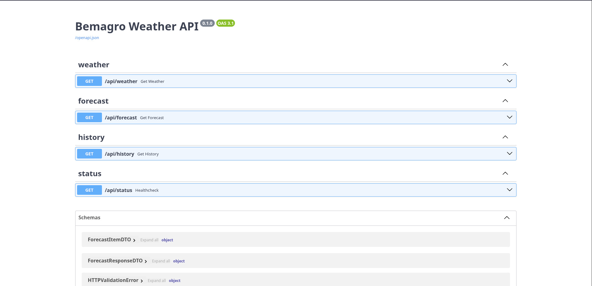

# Bemagro — Backend

API REST de previsão do tempo que integra com a [OpenWeather API](https://openweathermap.org/api), persiste o histórico de consultas em banco relacional e utiliza cache em Redis para reduzir chamadas externas.

## Deployment

API publicada na Render: **https://bem-agro-backend.onrender.com/docs**

Repositório: **https://github.com/Anthony07M/bem-agro-backend**

> A documentação interativa (Swagger UI) é gerada automaticamente pelo FastAPI e fica disponível em `/docs`. A especificação OpenAPI está em `/openapi.json` e o ReDoc em `/redoc`.

## Screenshot

<!-- Insira aqui o screenshot da documentação Swagger ou da API em execução -->



## Tecnologias

- **Python 3.13**
- **FastAPI** — framework web assíncrono
- **Uvicorn** — ASGI server
- **SQLAlchemy 2** (async) + **aiosqlite** — ORM e driver SQLite assíncrono
- **Alembic** — versionamento/migrações de banco
- **Redis** — cache de consultas à OpenWeather API
- **SlowAPI** — rate limiting
- **Pydantic v2** + **pydantic-settings** — validação e configuração
- **httpx** — cliente HTTP assíncrono (chamadas à OpenWeather)
- **Sentry SDK** — observabilidade de erros
- **Pytest** + **pytest-asyncio** — testes unitários e e2e
- **Locust** — testes de carga (`locustfile.py`)
- **Docker** (imagens separadas para dev e prod) + **docker-compose**

## Endpoints principais

| Método | Rota | Descrição |
| --- | --- | --- |
| `GET` | `/api/weather?city={city}` | Clima atual de uma cidade |
| `GET` | `/api/forecast?city={city}` | Previsão das próximas horas |
| `GET` | `/api/history` | Histórico de consultas realizadas |
| `GET` | `/api/status` | Health check da API |
| `GET` | `/docs` | Swagger UI |
| `GET` | `/redoc` | ReDoc |

## Pré-requisitos

- Python 3.13+
- pip
- Docker + Docker Compose (opcional, mas recomendado para rodar Redis localmente)
- Chave de API da [OpenWeather](https://home.openweathermap.org/api_keys)

## Como clonar e executar localmente

### 1. Clonar o repositório

```bash
git clone https://github.com/Anthony07M/bem-agro-backend.git
cd bem-agro-backend
```

### 2. Criar e ativar um ambiente virtual

```bash
python3 -m venv venv
source venv/bin/activate     # Linux/macOS
# .\venv\Scripts\activate    # Windows
```

### 3. Instalar as dependências

```bash
pip install --upgrade pip
pip install -r requirements.txt
```

### 4. Configurar variáveis de ambiente

Copie o arquivo `.env.example` para `.env`:

```bash
cp .env.example .env
```

Abra o arquivo `.env` e preencha os valores:

```env
OPENWEATHER_API_KEY=sua_chave_do_openweather
DATABASE_URL=sqlite+aiosqlite:///./data/app.db
REDIS_URL=redis://localhost:6379/0
```

| Variável | Descrição |
| --- | --- |
| `OPENWEATHER_API_KEY` | Chave de acesso à API da OpenWeather |
| `DATABASE_URL` | URL de conexão do SQLAlchemy (async). Padrão: SQLite em `./data/app.db` |
| `REDIS_URL` | URL de conexão com o Redis usado para cache |

### 5. Subir dependências (Redis)

Se não tiver Redis instalado localmente, suba apenas esse serviço via docker-compose:

```bash
docker compose up -d redis
```

### 6. Aplicar migrações

```bash
alembic upgrade head
```

### 7. Rodar o servidor em modo desenvolvimento

```bash
uvicorn src.main:app --reload --host 0.0.0.0 --port 8000
```

Acesse:

- API: http://localhost:8000
- Swagger UI: http://localhost:8000/docs
- ReDoc: http://localhost:8000/redoc

## Scripts e comandos úteis

| Comando | Descrição |
| --- | --- |
| `uvicorn src.main:app --reload` | Inicia o servidor em modo dev (hot reload) |
| `alembic upgrade head` | Aplica todas as migrações |
| `alembic revision --autogenerate -m "msg"` | Cria uma nova migração |
| `pytest` | Executa toda a suíte de testes |
| `pytest tests/unit` | Executa apenas testes unitários |
| `pytest tests/e2e` | Executa apenas testes end-to-end |
| `locust -f locustfile.py` | Executa testes de carga |

## Executando com Docker

O projeto inclui **dois Dockerfiles** e um `docker-compose.yml`:

- **`Dockerfile.dev`** — imagem de desenvolvimento com hot reload (`--reload`).
- **`Dockerfile.prod`** — imagem multi-stage enxuta para produção, usando `uvicorn` com múltiplos workers.

### Opção A — docker-compose (API + Redis) — recomendado para dev

O `docker-compose.yml` já configura a API (`Dockerfile.dev`), um Redis e um volume de dados persistente.

Certifique-se de que o `.env` está preenchido e execute:

```bash
docker compose up --build
```

Para rodar em background:

```bash
docker compose up -d --build
```

Para parar e remover os containers:

```bash
docker compose down
```

A API fica disponível em http://localhost:8000.

### Opção B — Build e run manual (imagem de produção)

#### 1. Buildar a imagem

```bash
docker build -f Dockerfile.prod -t bem-agro-backend .
```

#### 2. Rodar a imagem

Como a imagem de produção depende do Redis, o caminho mais simples é conectá-la à mesma network do compose ou apontar o `REDIS_URL` para um Redis acessível:

```bash
docker run --rm \
  -p 8000:8000 \
  --env-file .env \
  --name bem-agro-backend \
  bem-agro-backend
```

Para rodar em background:

```bash
docker run -d \
  -p 8000:8000 \
  --env-file .env \
  --name bem-agro-backend \
  bem-agro-backend
```

Para parar e remover o container:

```bash
docker stop bem-agro-backend
docker rm bem-agro-backend
```

> Ajuste o número de workers exportando `APP_WORKERS` (padrão: `4`) antes do `docker run`, ou passe com `-e APP_WORKERS=2`.

## Estrutura do projeto

```
backend/
├── src/
│   ├── main.py                 # Bootstrap da aplicação FastAPI (lifespan, CORS, routers)
│   ├── config.py               # Configurações via pydantic-settings
│   ├── domain/                 # Entidades e contratos de repositórios
│   ├── application/            # Casos de uso
│   ├── infrastructure/
│   │   ├── database/           # Conexão, modelos e repositórios SQLAlchemy
│   │   ├── cache/              # Cliente Redis
│   │   └── services/           # Integrações externas (OpenWeather)
│   └── presentation/
│       ├── routers/            # Rotas: weather, forecast, history, status
│       ├── schemas/            # DTOs Pydantic
│       ├── dependencies.py     # Dependências FastAPI
│       └── rate_limiter.py     # Configuração do SlowAPI
├── migrations/                 # Alembic
├── tests/
│   ├── unit/
│   └── e2e/
├── data/                       # Volume com o SQLite
├── locustfile.py               # Cenário de carga
├── docker-compose.yml
├── Dockerfile.dev
├── Dockerfile.prod
├── alembic.ini
├── pytest.ini
├── requirements.txt
└── .env.example
```
